# Ubuntu 18.04.1 installation

1. Download and install [virtualbox](https://www.virtualbox.org/wiki/Downloads)
2. Download the disc images for [Ubuntu 18.04.1](https://www.ubuntu.com/download/desktop/thank-you?version=18.04.1&architecture=amd64)
3. After you have installed virtualbox (my recommendation is to install it into a folder named C:\utils\virtualbox for windows users), complete the following steps after starting up virtual box

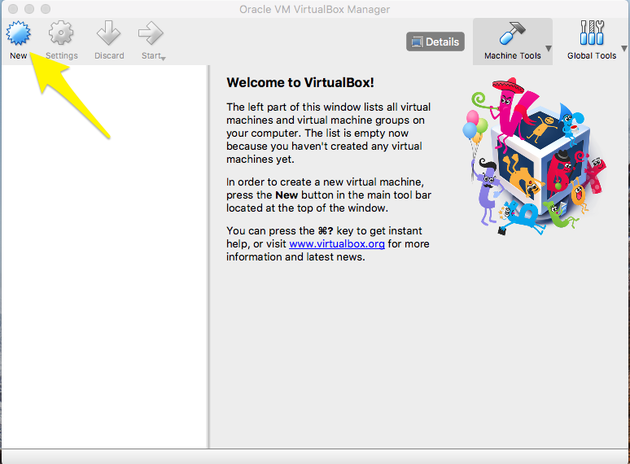

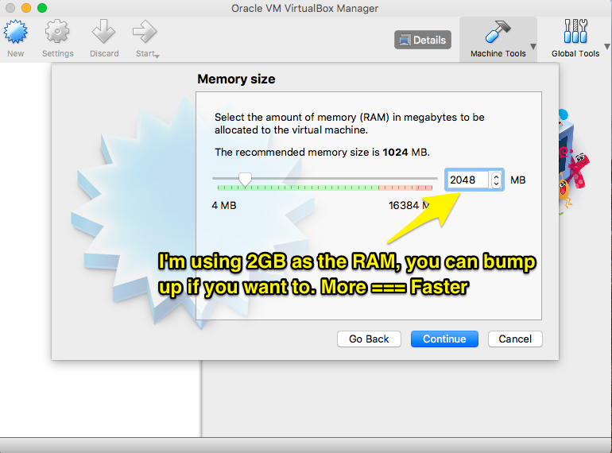

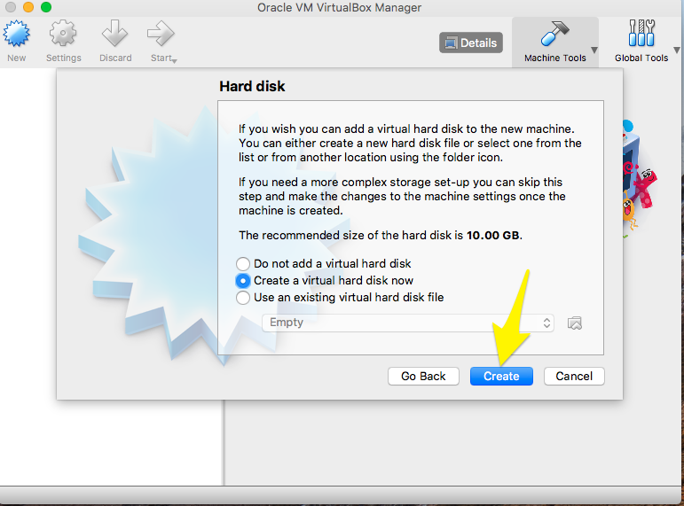

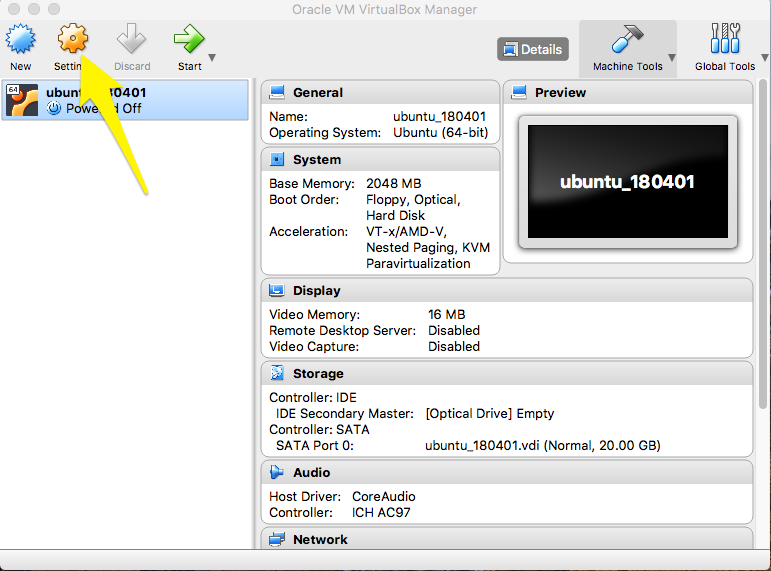

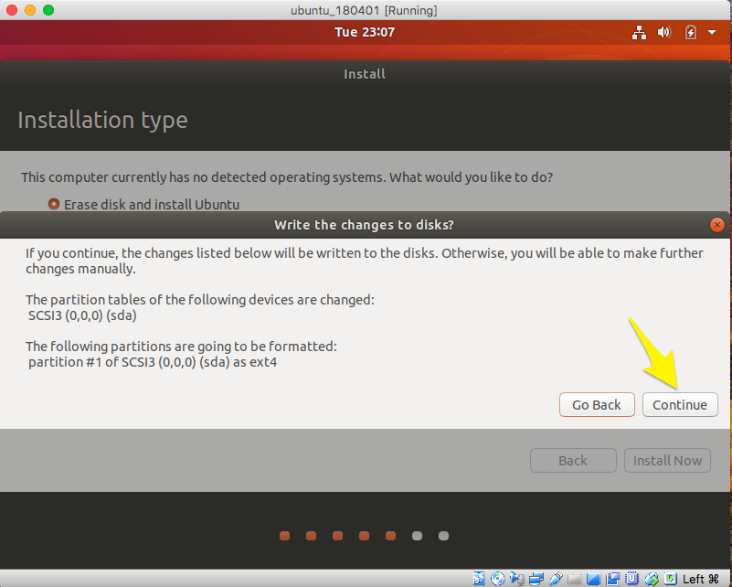

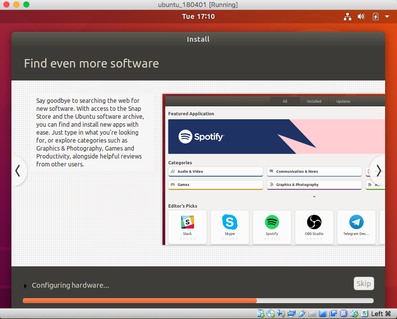
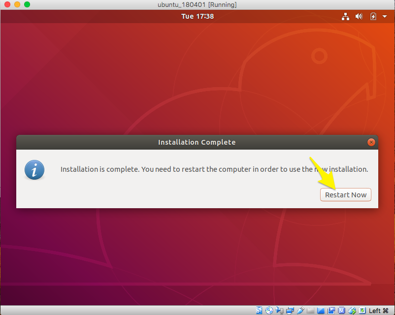
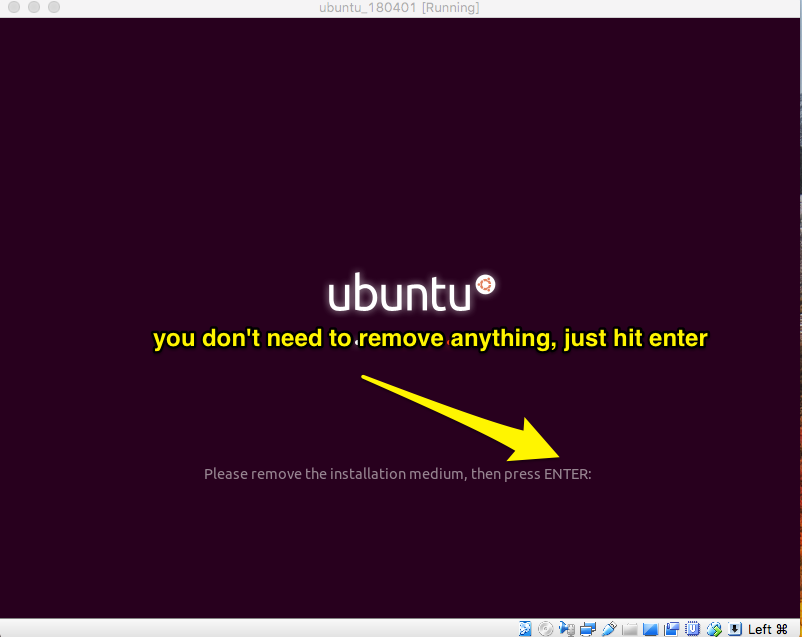

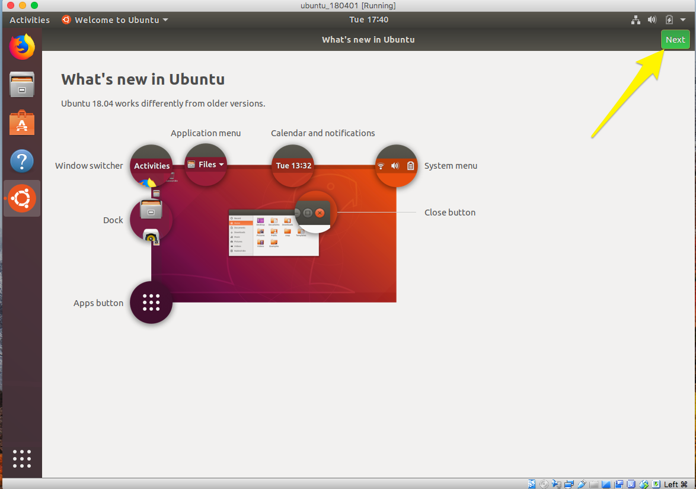

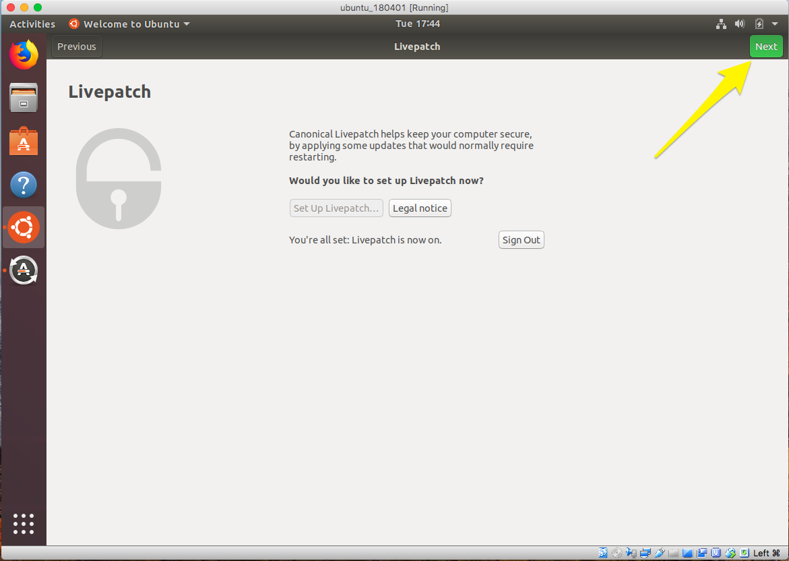
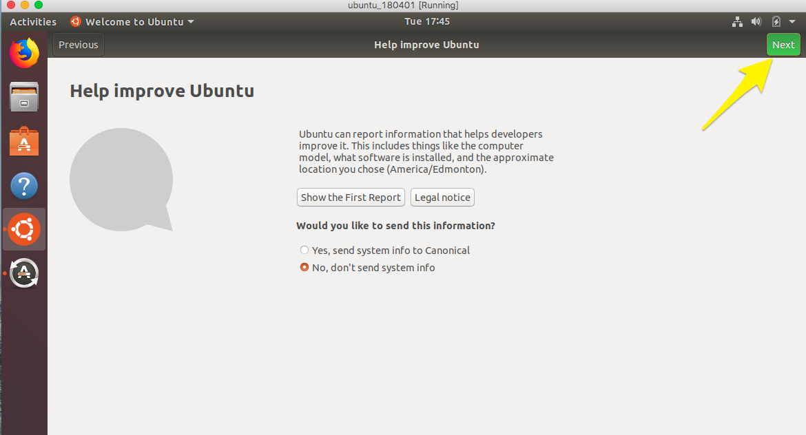

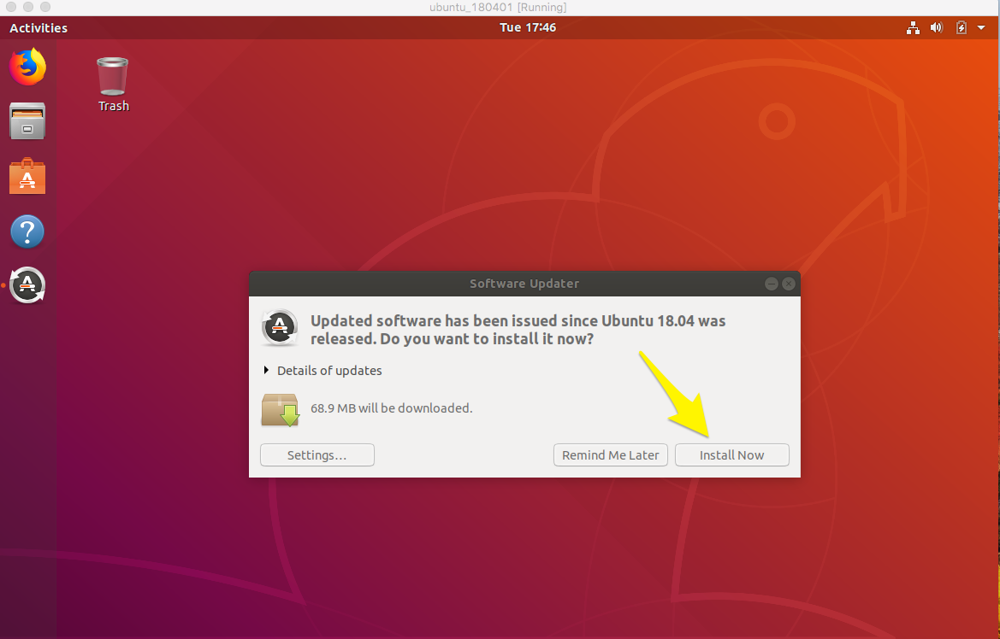
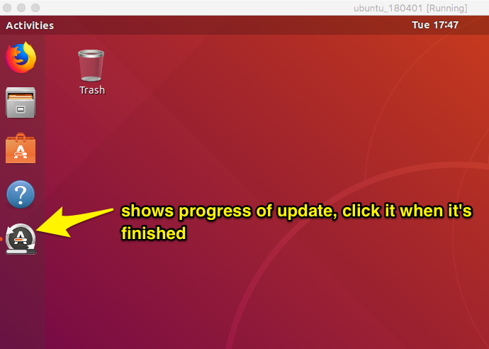

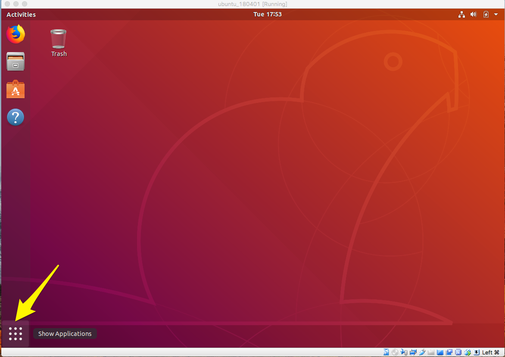
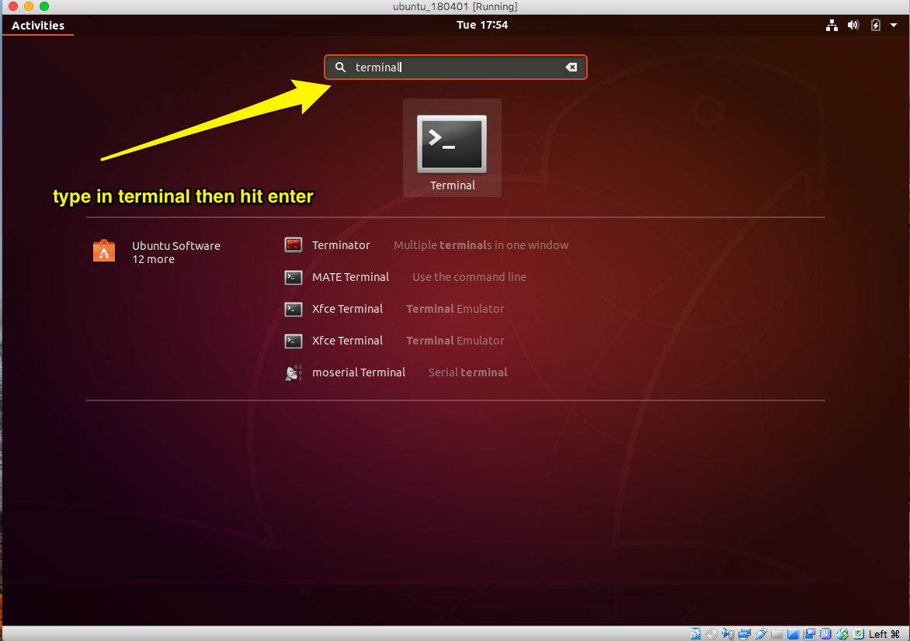
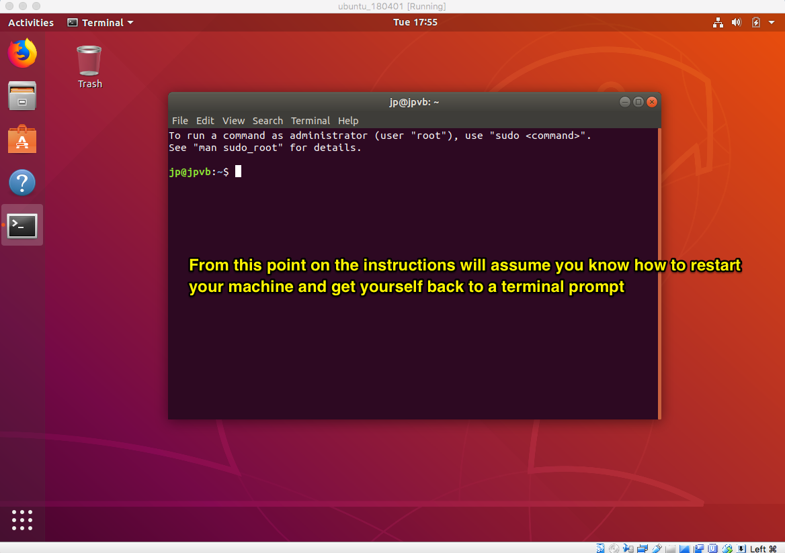
